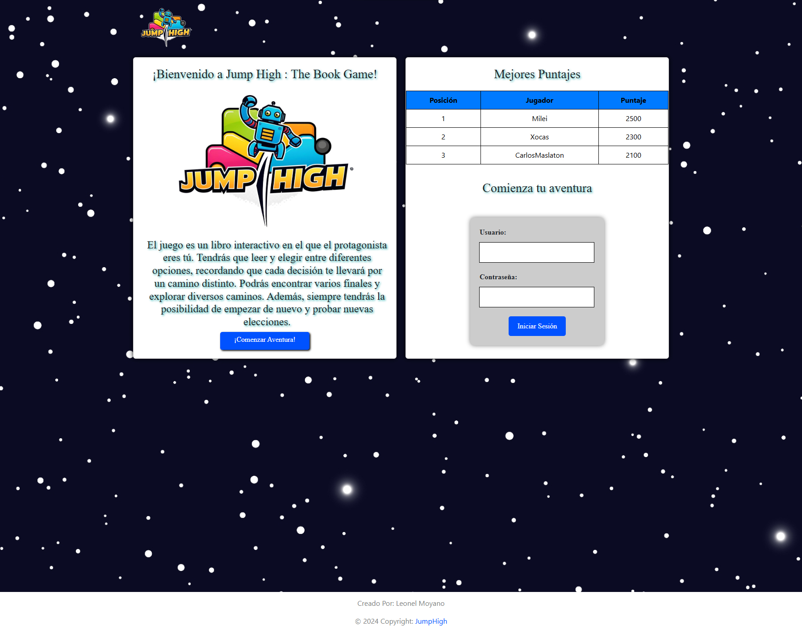
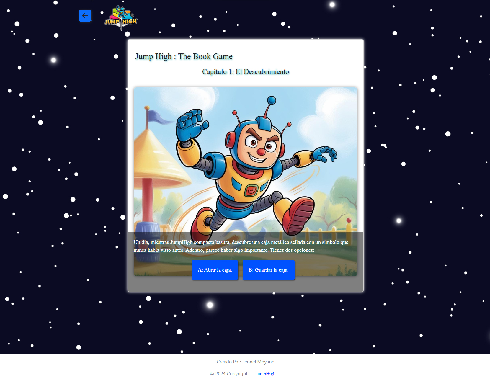
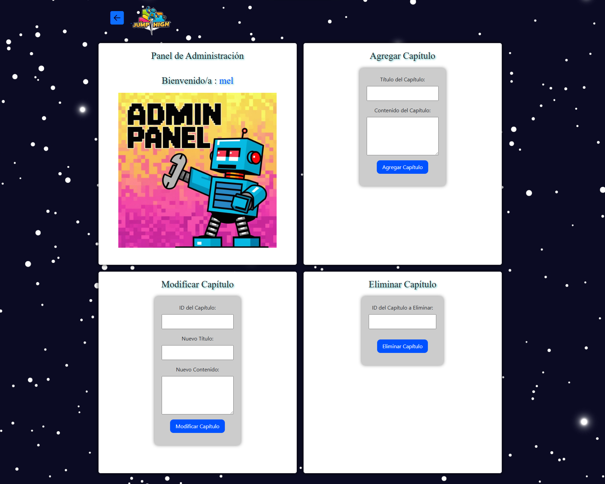

# JUMP HIGH: The Book Game

Este proyecto universitario consiste en el desarrollo de un librojuego interactivo compuesto por tres páginas web interconectadas, diseñadas para ser estéticas, intuitivas y totalmente responsivas. Se enfoca en ofrecer una experiencia de usuario envolvente y funcional.

# 📝 Descripción del Proyecto

El librojuego está dividido en tres partes principales:

# Página Principal (index.html):

* Información introductoria del librojuego.
  
* Historial de puntajes más altos obtenidos por los jugadores.

* Formulario de inicio de sesión con funcionalidad básica.

  

# Página del Librojuego (librojuego.html):
  
* Historia interactiva con opciones para avanzar en la narrativa.
  
* Múltiples capítulos con al menos cuatro finales diferentes.

* Formulario visual para registrar el puntaje del jugador.
  

# Página de Administración (admin.html):

* Panel exclusivo para el administrador con una bienvenida personalizada.

* Sección de ABM de capítulos:

* Alta, baja y modificación de capítulos (formularios solo visuales).

* Navegación para regresar a la página principal.
  

# ✨ Tecnologías Utilizadas

* HTML5: Estructura de las páginas.

* CSS3: Estilización y diseño responsivo.

* JavaScript: Funcionalidades interactivas.
